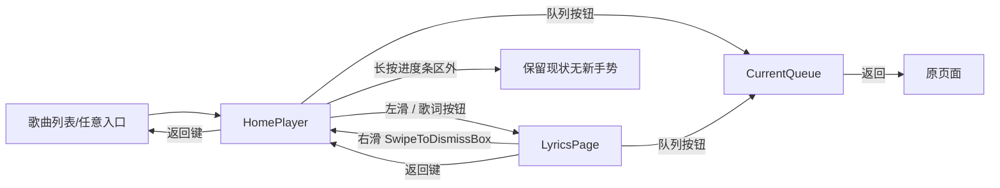

# REQ-HOME-SEEK / REQ-LYRICS-PAGE 增量方案（HomePlayer 进度条 + 独立歌词页）

状态：待用户确认。确认后按 HOME-SEEK-001 → LYRICS-PAGE-002 → LYRICS-MIN-003 → LINK-004 → TEST-005 实现。

## 一、现状盘点（阅读结论）

- **HomePlayer**（`WearJellyApp.kt` PlayerScreen）：ScalingLazyColumn 单页堆叠——封面 90dp、标题、缓冲条、错误、**只读进度条**（已播放+缓冲两层，无任何手势）、三键传输行（上一首/播放/下一首）、音量/随机/循环行、队列/歌词入口行。`seekTo/seekRelative`（±任意 ms）在 AppViewModel 已存在且未接 UI。
- **LyricsScreen**（现存"歌词"页）：ScalingLazyColumn 全量行列表 + 当前行高亮；无点击跳转、无偏移、无环形进度、无底部控制栏。数据链：`AppViewModel.loadLyrics()` → `repository.lyrics(itemId)`（Jellyfin `Audio/{id}/Lyrics` JSON API）→ `SongLyrics(lines, isSynchronized)`；**API 只提供行级时间戳**（LRC 等价），逐字数据源不存在。
- **关键缺陷①**：`repository.lyrics()` 把 404/405/501（无歌词）和网络异常都返回 `null`——**"无歌词"与"加载失败"目前无法区分**，验收 12 需要先修这里。
- **CurrentQueue**：`PlaybackState.queue: List<QueueTrack>`（服务 timeline 唯一数据源）+ `QueueScreen`（当前行高亮、点击切歌、删除按钮已有）。队列拖拽排序砍掉（规格四），不动。
- **CacheIndex**：`DownloadManager.cachedTrackIds: StateFlow<Set<String>>` 已存在（downloads 派生、删除/完成实时更新，无逐项 IO）——验收 14 直接订阅即可，HomePlayer/LyricsPage/QueueScreen 角标共用。
- **手势环境**：非根页面整体包 `SwipeToDismissBox`（右滑=goBack）；ScalingLazyColumn 垂直滚动；MT ticket 沉淀的行级手势范式（意图判定+消费策略）可直接复用。
- **持久化模式**：`SessionStore` 用 SharedPreferences 存 bitrate——歌词偏移/字号沿用此模式。
- **位置刷新粒度**：`PlaybackConnection` 500ms 位置 ticker；seek 后最迟 500ms 才反映——seek 后歌词/进度条需立即同步（小改 `seekTo` 后主动 `updateStateFromPlayer`）。

## 二、总体增量方案（不重做 MT 多选 / 队列 / 缓存逻辑）

1. **HomePlayer**：只读进度条升级为 `SeekableProgressBar`（可拖动+气泡+误触取消+触觉），传输行扩为 5 键（-10s / 上一首 / 播放暂停 / 下一首 / +10s）；播放结束按钮变重播（Media3 `play()` 在 STATE_ENDED 自动从头播，无需新逻辑）。
2. **LyricsPage**：新独立页（沿用 `AppScreen.Lyrics` 栈位），整页 Box 布局：环形进度条（贴边、细、不可拖）+ 顶部中央当前时刻 + 三行歌词（前/当前/后，当前行高亮）+ 底部固定控制栏（播放/暂停、上一首、下一首）+ 队列入口 + 缓存角标。替换现有 LyricsScreen。
3. **导航**：沿用自定义 backStack——HomePlayer 左滑 `navigate(Lyrics)`；LyricsPage 右滑由现有 SwipeToDismissBox 承接（goBack → Player）；返回键在 LyricsPage 走栈内 goBack 回 HomePlayer（现有 BackHandler 语义已满足）；HomePlayer 返回键照旧返回上一页。
4. **歌词逻辑纯函数化**：`LyricsLogic`（二分查当前行、偏移换算、状态归类）+ JVM 单测，与 SelectionState 同范式。
5. **歌词结果三态**：`repository.lyrics()` 改返回 `LyricsResult{ Found / NotFound / Error }`，UI 才能做出"暂无歌词（可能是纯音乐）/加载失败可重试/加载中"。
6. **不做的**（规格四全单照砍）：逐字动画、歌词编辑/搜索/导入、多源切换、悬浮歌词、动态背景、拖拽排序队列等一律不实现。

## 三、页面导航图



- CurrentQueue 保持单一实例页面，两边入口导航到同一个 `AppScreen.Queue`；返回回到进入前页面（现有栈语义）。
- LyricsPage 在栈中位于 HomePlayer 之上；二次左滑不会重复入栈（`navigate` 已去重截断）。

## 四、手势状态机

### 4.1 进度条拖动（SeekableProgressBar，区域独占水平手势）

```
状态：IDLE / PRESSED / DRAGGING

IDLE --down 在触摸区(高40dp)--> PRESSED            记录起点/起始时间
PRESSED --up 且未超 tap 判定--> IDLE               单击不响应（决策：防误触）
PRESSED --|dx|>slop 且横向占优(|dx|≥|dy|)--> DRAGGING   进入拖动：气泡出现、暂停自动刷新
PRESSED --纵向占优--> IDLE(不消费)                  让位给列表垂直滚动
DRAGGING --move--> targetMs = clamp(start + (dx/条宽)*totalMs)   气泡显示 mm:ss / mm:ss
DRAGGING --每跨过 5s 边界--> 触觉反馈一次（可选开关，默认开）
DRAGGING --up--> |dx| < 24dp ? 取消(回原进度, IDLE)  : seekTo(targetMs) 后 IDLE
```

- 拖动中不实时 seek（决策已定），UI 时间显示 `dragTargetMs`；ticker 输出被遮蔽。
- 进度条 zone 消费全部横向事件 → 容器左滑切页在该区域不触发（规格要求）；纵向不消费。
- 禁用态：`current==null` → 整条隐藏时间并禁用；`durationMs<=0` → 显示但不可拖（直播/未知时长）；缓冲中且 position==0 → 不确定动画。
- 圆形屏安全区：条宽 fillMaxWidth(0.8f)，触摸区上下 padding，不贴边。

### 4.2 页面级左右滑（HomePlayer 容器）

```
HomePlayer 根 Box pointerInput：
  纵向意图(|dy|>|dx|) → 不消费（ScalingLazyColumn 滚动）
  右滑(dx>0) → 不消费（SwipeToDismissBox 返回上一页）
  左滑 |dx|≥max(2×touchSlop,24dp) 且 |dx|≥2|dy| → 消费并 navigate(Lyrics)
进度条区域在子层先行消费横向事件 → 左滑切页天然被屏蔽（验收 5）
```

### 4.3 LyricsPage

- 无页面级自定义手势：右滑由应用级 SwipeToDismissBox 承接；行点击=seek；长按=打开歌词设置二级菜单（见 4.4）；环形进度条纯绘制不可交互。无列表滚动 → 左右滑/点击无冲突面（验收 16）。

### 4.4 歌词设置二级菜单（隐藏）

```
LyricsPage 长按 → 弹出设置面板：
  歌词偏移：-0.5s / +0.5s / 重置（每首歌记忆，persistent）
  字号：小 / 中 / 大（全局记忆）
  翻译显示：开关（只读，见决策 D4）
```

## 五、歌词显示与同步

- **当前行判定**（纯函数，单测覆盖）：`effectiveMs = positionMs - offsetMs`；在时间戳数组二分找最后一个 `startMs ≤ effectiveMs` 的行；无时间戳（非同步歌词）→ 全文滚动列表模式（现实现保留），不做三行模式。
- **三行布局**：上一行（低亮度）/ 当前行（高亮居中）/ 下一行；行数不足时留白；切行瞬时无动画依赖（简单 crossfade 可选）。
- **seek 同步**：`PlaybackConnection.seekTo` 后立即 `updateStateFromPlayer`，positionMs 即时更新 → 歌词与进度条同步（验收 7/10）。
- **偏移语义**：`+0.5s` = 歌词整体延后 0.5s（判定时刻 = position - offset）；每首歌 `Map<itemId, offsetMs>` 存 SharedPreferences（`LyricsPrefs`），重启生效（验收 11）。
- **翻译**（D4）：Jellyfin Lyrics API 无翻译字段。方案：识别"时间戳完全相同的重复行"为嵌入式翻译行，受开关控制显隐；数据不存在时开关无效果（UI 只读，不报错）。

## 六、文件修改清单（按 ticket）

### REQ-HOME-SEEK-001（进度条显示 + 拖动 + ±10s）
- 新增 `ui/SeekableProgressBar.kt`：拖动状态机、气泡、禁用/不确定态、触觉；几何换算函数留纯函数便于单测。
- `WearJellyApp.kt` PlayerScreen：替换现只读进度条；传输行 5 键（±10s 用 `seekRelative(±10_000)`，已存在）；播放结束态图标。
- `PlaybackConnection.kt`：`seekTo` 后立即 `updateStateFromPlayer`（即时反馈，LINK-004 共用）。
- 验收：3、4、5、6、7、8 + 拖动不切页。

### REQ-LYRICS-PAGE-002（LyricsPage + 左滑进右滑回 + 展示与点击跳转）
- 新增 `ui/LyricsPage.kt`：RingProgress(Canvas)、ThreeLineLyrics、底部控制栏、队列入口、角标、空/错/加载态；替换 LyricsScreen。
- 新增 `ui/LyricsLogic.kt`：当前行二分、偏移换算、三态归类 + JVM 单测。
- `JellyfinRepository.kt`：`lyrics()` 返回 `LyricsResult`（区分 NotFound/Error）。
- `AppViewModel.kt`：loadLyrics 适配三态；暴露 `currentLyricIndex` 派生。
- `WearJellyApp.kt`：PlayerScreen 容器左滑手势 → navigate(Lyrics)。
- 验收：1、2、9、10、16 + 导航图全部边。

### REQ-LYRICS-MIN-003（偏移 / 字号 / 翻译 / 空态文案）
- 新增 `data/LyricsPrefs.kt`：per-song offset Map、字号、翻译开关持久化。
- `AppViewModel.kt`：暴露 flows + `adjustLyricsOffset(±0.5s)/resetLyricsOffset/setLyricsFontSize/toggleTranslation`。
- `ui/LyricsPage.kt`：长按二级菜单、字号三档应用、偏移即时生效。
- 验收：11、12、15（字号档位不溢出圆屏）。

### REQ-LINK-004（三页状态同步 + 缓存角标）
- `AppViewModel.kt`：暴露 `cachedTrackIds`。
- `WearJellyApp.kt`：HomePlayer 标题旁、LyricsPage 头部、QueueScreen 行内角标（`✓`/小图标）；删除缓存时角标随 `cachedTrackIds` 实时消失（已有数据链，纯 UI 订阅）。
- 验收：13、14。

### REQ-TEST-005（回归）
- `./gradlew testDebugUnitTest assembleDebug` + TicWatch Pro X 真机回归 16 条；重点：拖动 vs 左滑切页、进度条纵向 vs 列表滚动、右滑返回 vs 歌词行点击、圆屏裁剪。

## 七、待确认决策点

- **D1 歌词页"预览"语义**：你说环形条显示"当前预览歌词对应时刻"。推荐 **A：点行立即 seek（验收 10），环/顶部时刻始终显示播放位置**；备选 B：首次点行仅预览（环/时刻跳到该行时刻，2 秒内再点确认 seek，超时回播放位置）。A 简单稳定，B 防误触但多一步。
- **D2 ±10s 按钮位置**：推荐传输行扩为 5 键（32/36/48/36/32dp，圆屏可容纳）；备选独立成行。
- **D3 纯音乐**：服务端无"纯音乐"标记，无法可靠识别；推荐与"无歌词"合并为"暂无歌词（可能是纯音乐）"一个空态。
- **D4 翻译数据源**：API 无翻译字段；仅当歌词内嵌"同时间戳重复行"时开关生效，否则无效但只读可切换。
- **D5 歌词设置入口**：推荐长按 LyricsPage 任意处；备选右上小齿轮。
- **D6 旧歌词入口**：PlayerScreen 原"歌词"按钮保留（与左滑等效导航）。

## 八、验收用例 → ticket 映射

| 用例 | 落点 |
|---|---|
| 1 左滑进歌词页 / 右滑返回 | LYRICS-PAGE-002 |
| 2 歌词页返回键回播放器 | LYRICS-PAGE-002（栈语义） |
| 3 封面+控制+进度条+双时间 | HOME-SEEK-001（已有多数，补齐） |
| 4 拖动气泡+跟随+松手 seek | HOME-SEEK-001 |
| 5 拖动不触发切页 | HOME-SEEK-001（区域独占） |
| 6 小位移误触不 seek | HOME-SEEK-001 |
| 7 ±10s 与歌词同步 | HOME-SEEK-001 + LINK（seek 即时刷新） |
| 8 无曲目禁用 / 无时长不可拖 | HOME-SEEK-001 |
| 9 三行歌词高亮自动滚动 | LYRICS-PAGE-002 |
| 10 点行跳转 | LYRICS-PAGE-002（D1-A） |
| 11 偏移 +0.5s 重启生效 | LYRICS-MIN-003 |
| 12 无歌词/纯音乐/失败可重试 | LYRICS-MIN-003（依赖 repository 三态） |
| 13 同一 CurrentQueue 高亮切歌 | LINK-004（已有多数，验证） |
| 14 三处缓存角标实时 | LINK-004（cachedTrackIds） |
| 15 圆屏不贴边不遮挡 | 各 ticket + TEST-005 |
| 16 歌词页手势稳定 | LYRICS-PAGE-002 + TEST-005 |
