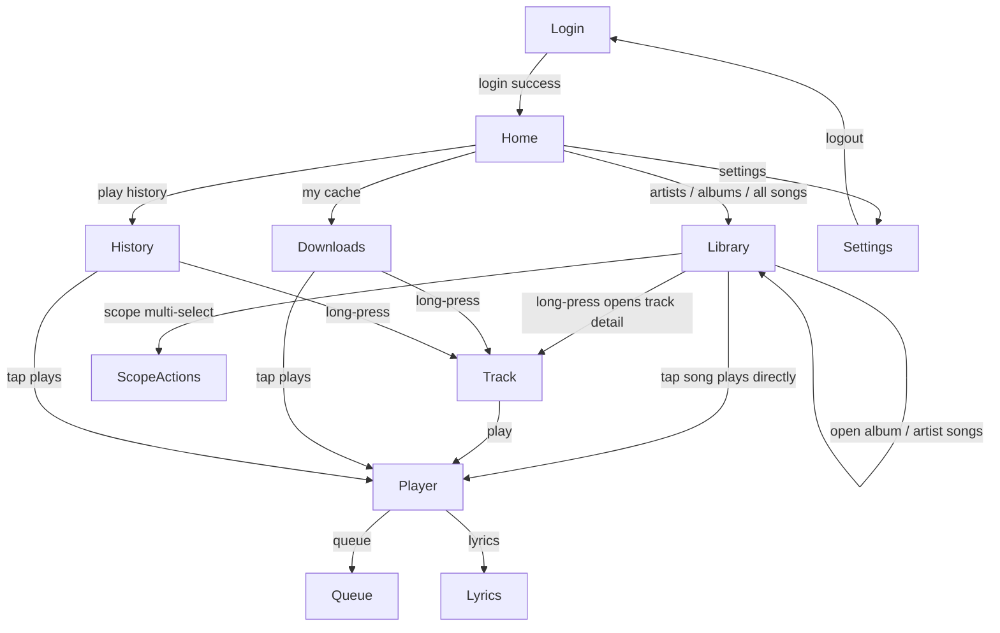

# WearJelly

面向 Wear OS 的独立 Jellyfin 音乐播放器，专为 **TicWatch Pro X（中国版，无 GMS）** 等不带 Google 服务的国行手表优化。纯手表端应用，无需手机配合，不包含任何 Google Play 服务、Firebase、Play Billing 或 Wearable Play API 依赖。

- 圆形屏幕适配（454×454），全中文界面
- 直接连接你自己的 Jellyfin 服务器，用户名密码登录
- 在线播放（含服务端实时转码）、离线缓存、播放历史、歌词
- 支持 Android 7.1.1（API 25）及以上的 Wear OS 手表

## 功能

### 音乐库浏览
- 艺人 / 专辑 / 所有歌曲 / 已缓存音乐 / 播放历史 五个入口
- 分页全量拉取歌曲库，Coil 加载封面
- 按英文与拼音首字母 A-Z 排序（中文转拼音），数字、假名及特殊字符归入 `#` 排在末尾

### 圆形屏幕字母索引条
- 「所有歌曲」右缘为贴边手势区：只有手指在屏幕右边缘上下滑动才会触发，不影响列表正常滚动
- 极简模式：平时只显示当前字母上下各 1 个（当前字母放大高亮），滑动时显示上下各 2 个并吸附到分组
- 字母按屏幕弧度排列，随屏幕形状自动适配

### 播放
- Media3 ExoPlayer + MediaSessionService 前台媒体服务，手表扬声器 / 蓝牙耳机播放，熄屏或退出界面后继续播放
- 播放队列：单曲入队、整张专辑 / 整个艺人全部入队、单曲移除、一键清空
- 歌词：Jellyfin 歌词接口，支持同步歌词
- 播放历史：自动记录最近 200 首，按最近播放时间排序
- 播放界面：进度拖动、音量调节（直接调节手表音量）、队列与歌词入口
- 列表中当前播放歌曲背景高亮，并显示动态音柱指示器

### 音质与转码（Finamp 风格）
- 四档在线音质：无损 / 原音频（直取原文件）、96 / 160 / 320 kbps（服务端实时转码）
- 设置持久保存，离线缓存下载同样使用所选音质

### 离线缓存
- 批量缓存（整个专辑 / 艺人 / 多选歌曲）或单曲缓存，所有任务立即全部入队
- 串行下载队列（单线程，保护低带宽服务器），「已缓存音乐」页面顶部有可折叠 / 展开的队列面板，实时显示每个任务的等待 / 下载进度 / 完成 / 失败状态
- 缓存进度条：服务端分块传输（无 Content-Length）时按时长 × 码率估算总大小
- 封面随歌曲一并缓存；播放优先使用本地文件，无网络可用

### 交互
- 点击歌曲直接播放；长按弹出详情菜单（单曲播放 / 全部入队 / 全部缓存 / 多选歌曲）
- 多选模式从长按菜单进入，而不是顶部按钮；支持批量入队与批量缓存
- 二级界面侧滑返回上一级而不是退出应用（只有根界面才允许侧滑退出）
- 长歌名渐隐过渡、列表项加大留白、主次分明的排版

## 技术实现

| 层 | 方案 |
| --- | --- |
| 语言 / UI | Kotlin + Jetpack Compose for Wear OS 1.4（Material for Wear） |
| 架构 | MVVM + StateFlow 单向数据流；自定义返回栈（`AppScreen` sealed interface），不引入导航库 |
| 依赖注入 | Koin |
| 播放 | Media3 1.4.1：ExoPlayer + MediaSessionService + MediaController（SessionToken），通过自定义 SessionCommand 操作队列 |
| 网络 | OkHttp（含 media3-datasource-okhttp 数据源） |
| 序列化 | kotlinx.serialization |
| 服务端 API | Jellyfin REST 直连（无官方 SDK）：`/Users/AuthenticateByName`、`/Items`、`/Audio/{id}/stream`（原文件与转码）、`/Audio/{id}/Lyrics`，`X-Emby-Authorization` 鉴权 |
| 会话存储 | Android Keystore AES-256-GCM 加密后写入 noBackupFilesDir，重启免登录 |
| 排序 | pinyin4j 将汉字转拼音后按首字母分桶（A-Z + `#`） |
| 手势 | Compose `awaitEachGesture` 手写识别：垂直意图判定、整手势独占消费，支撑贴边字母索引与二级界面侧滑返回 |
| 无 GMS 保障 | 自定义 `verifyNoGms` Gradle 任务在打包前校验全部运行时依赖，出现 gms / firebase / billing / wearable 依赖即构建失败 |

**转码与缓存的实现要点**：在线播放按所选码率请求 `stream.mp3?audioCodec=mp3&audioBitRate=…`；缓存下载走同一接口，把响应体流式写入应用私有目录，同时下载封面 `{id}.jpg` 并维护索引 JSON，删除操作同时清理下载列表与队列。

## 系统要求

- Wear OS 手表，Android 7.1.1（API 25）及以上。下限由 Wear Compose 1.4 决定，已在 TicWatch Pro X（Android 9，454×454 圆屏）上验证
- 可访问的 Jellyfin 10.8+ 服务器

## 安装

1. 从 [Releases](../../releases) 下载最新的 `app-release.apk`
2. 手表开启 ADB 调试（开发者选项 → ADB 调试 / 通过 WLAN 调试），在电脑上执行：

```bash
adb install app-release.apk        # 首次安装
adb install -r app-release.apk     # 覆盖升级
```

## 构建

```bash
./gradlew :app:assembleRelease       # 编译签名 release APK
./gradlew :app:verifyNoGms           # 校验无 Google 服务依赖
./gradlew :app:testReleaseUnitTest   # 运行 JVM 单元测试
```

release 签名读取项目根目录的 `keystore.properties`（格式见 `keystore.properties.example`，真实文件已被 gitignore）；未配置时使用调试签名。

## 导航结构

导航是 `AppViewModel` 中的自定义返回栈（`AppScreen` sealed interface）——没有使用导航库，因此 IDE 的导航图工具不适用于本项目。



`Queue`、`Lyrics`、`ScopeActions` 为叶子界面（只能返回），`Confirm` 界面统一处理破坏性操作的确认。

## 已知限制

- 在 TicWatch Pro X 的 rover ROM 上，`ScalingLazyColumn` 的自定义缩放参数无法生效（所有行都会缩到最小值），因此列表采用库默认的全尺寸布局；「中间两行放大、边缘缩小」的观感需要自定义布局实现，尚未构建
- 服务端不返回 Content-Length 时，转码缓存进度为估算值

---

<details>
<summary>English</summary>

WearJelly is a standalone Jellyfin music player for Wear OS watches, built for the China-market TicWatch Pro X and other watches without Google services. No phone companion, no Google Play services, Firebase, Play Billing or Wearable Play API.

**Features:** artist / album / all-songs browsing; pinyin-aware A-Z sorting with an edge-swipeable arc alphabet index; playback via Media3 ExoPlayer + MediaSessionService with queue management, synchronized lyrics and play history; Finamp-style bitrate selection (original passthrough or server-side transcoding at 96/160/320 kbps); offline download queue with a collapsible progress panel and cached covers; tap to play, long-press for detail and multi-select.

**Tech:** Kotlin + Jetpack Compose for Wear OS, MVVM with StateFlow, Koin DI, Media3 1.4.1, OkHttp, kotlinx.serialization, a custom back stack instead of a navigation library, Android Keystore (AES-256-GCM) session storage, pinyin4j sorting, and a `verifyNoGms` Gradle task that fails the build if any Google dependency enters the runtime classpath.

**Requirements:** Wear OS, Android 7.1.1 (API 25)+; Jellyfin 10.8+. Install the APK from Releases with `adb install app-release.apk`.

</details>